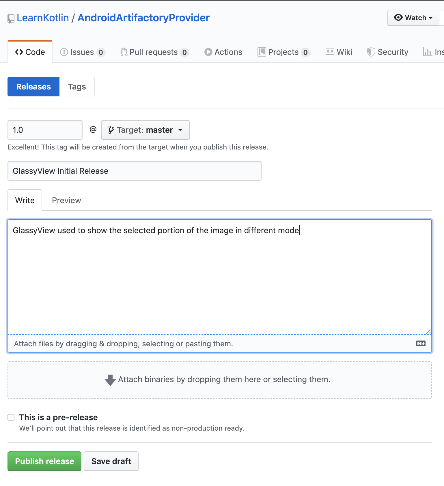
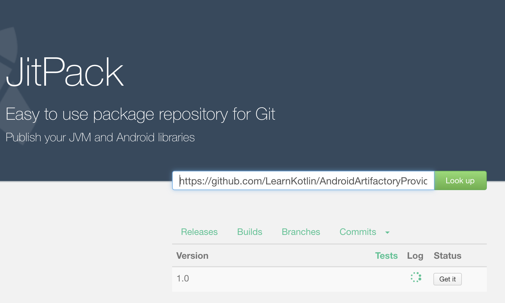

# AndroidArtifactoryProvider

Step by step approach to share your good work to community using Github and Jitpack.

- Create new Android project.

- Create new Android library module which shares your code.

- perform gradle sync and push source code to github repo.

- Create a new release by creating a new version tag, as specified in second step ie., version_number.

- Goto jitpack.io, copy github repo location lookup release tag
ie., https://github.com/LearnKotlin/AndroidArtifactoryProvider
Press "Get it" and wait till loading is complete and artifactory is built

