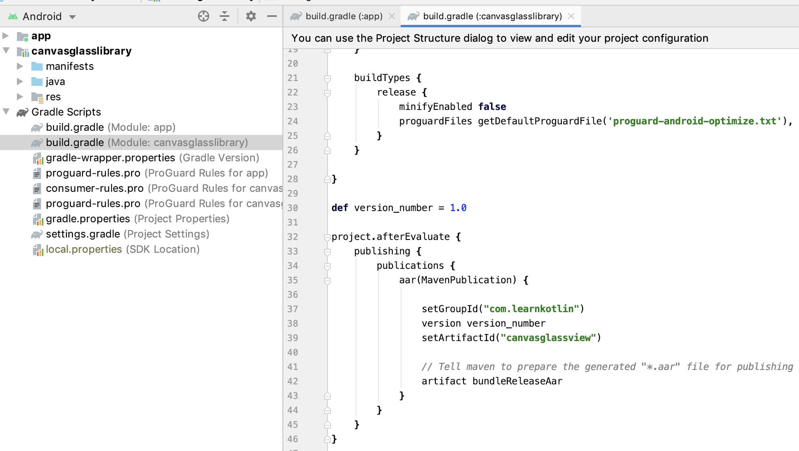

# AndroidArtifactoryProvider

Step by step approach to share your good work to community using Github and Jitpack

- Create new Android project.
- Create new Android library module which shares your code

